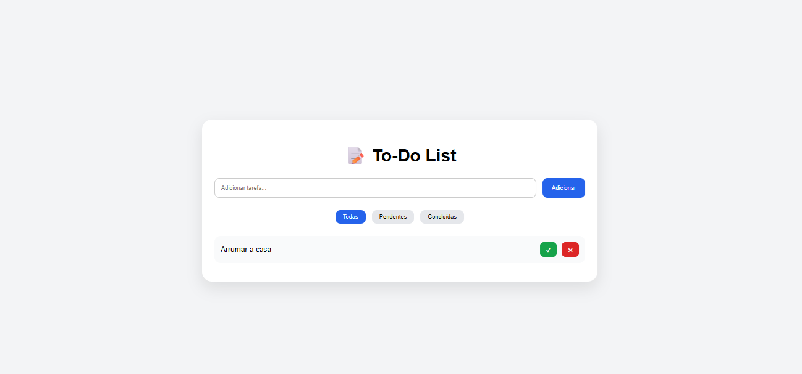

# 📝 To-Do List com Recoil


---

## 📌 Sobre o projeto

Aplicação de gerenciamento de tarefas (To-Do List) desenvolvida com **React + Recoil**, focada em organização de estado global, boas práticas e estrutura escalável.

O projeto permite criar, visualizar, filtrar e gerenciar tarefas de forma simples e eficiente.

---

## 🚀 Funcionalidades

* ✅ Adicionar novas tarefas
* 📋 Listar tarefas
* ✔️ Marcar tarefas como concluídas
* ❌ Remover tarefas
* 🔍 Filtrar tarefas:

  * Todas
  * Pendentes
  * Concluídas

---

## 🛠 Tecnologias utilizadas

* React
* Recoil
* Vite
* CSS puro

---

## 📦 Como rodar o projeto

```bash
# Clonar repositório
git clone https://github.com/SEU-USUARIO/todo-recoil.git

# Entrar na pasta
cd todo-recoil

# Instalar dependências
npm install

# Rodar projeto
npm run dev
```

---

## 📁 Estrutura do projeto

```
src/
├── atoms/
├── selectors/
├── components/
├── App.jsx
└── main.jsx
```

---

## 📸 Preview



---

## 🔗 Deploy

👉 Em breve...

<!-- Exemplo quando fizer deploy -->

<!-- [Acessar aplicação](https://seu-projeto.vercel.app) -->

---

## 📄 Licença

Este projeto está sob a licença MIT.

---

## 👨‍💻 Autor

Desenvolvido por **Douglas Melo**

* GitHub: https://github.com/SEU-USUARIO
* LinkedIn: (coloque aqui depois)

---

## 💡 Melhorias futuras

* Persistência com LocalStorage
* Edição de tarefas
* Drag and Drop
* Dark Mode
* Integração com backend

---

## ⭐ Contribuição

Sinta-se à vontade para abrir issues ou contribuir com melhorias!

---

## ⚡ Status do projeto

🚧 Em desenvolvimento
